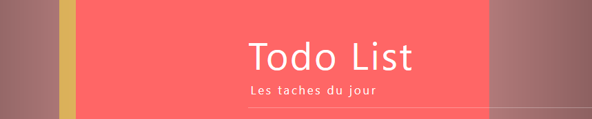

# DFS_Front_E4_Diallo_Faure_Projet1


Application type ToDo List.  
Choix fait de repartir du code initial repris de l'application transmise en cours.

* Animations de types SCSS et CSS avec classes

---
## Getting Started

This project was bootstrapped with [Create React App](https://github.com/facebook/create-react-app).

### Prerequisites

Things you need to install the software and how to install

```
$ npm install
$ npm start
```
---
## FONCTIONNALITES
---
### Animation sur le titre  
  
:arrow_forward: TodoList.js
```
        <h1
          style={{
            animation: "slidein 3s ease-in 4s infinite alternate both running",
          }}
        >
          Todo List <span>Les taches du jour</span>
        </h1>
```  
:arrow_forward: lié à Todo.css  
```  
  @keyframes slidein {
    from {
      margin-left: 50%;
      width: 300%;
    }
  
    to {
      margin-left: 0%;
      width: 100%;
    }
  }
```
- Interaction utilisateur
> A l'ouverture de l'application, le titre de l'application est mis en évidence.

- Type d'animations CSS utilisée
> SCSS avec balise style

- Explication de l'implémentation
> * Slidein : nom de l'animation défini en @keyframes  
> * 3s : temps pour faire 1 cycle d'animation  
> * Ease-in : fonction - slow at the beginning, fast/abrupt at the end  
> * 1s : retard au lancement de l'animation  
> * Infinite : animation-iteration-count - se reproduit à l'infini  
> * alternate: animation-direction  
> * Both : animation-fill-mode - extension des propriétés de l'animation dans les deux directions  
> * Running : animation-play-state : animation est en cours d'exécution  
---
### Animation lors de l'édition d'une tâche ou de l'ajout d'une tâche 
  
:arrow_forward: Todo.css
```
animation-name: couleur, essuieglace, taille;
    animation-duration: 10s;
```  
:arrow_forward: couleur, essuieglace et taille définis dans les @keyframes Todo.css  
```
  @keyframes couleur{
    from{background-color: orange;}
    50%{background-color: purple;}
    to{background-color: rgba(255, 255, 255, 0.1);}
  }
  
  @keyframes taille{
    from{width: 100%}
    50%{width: 70%;}
    to{width: 126.5%;}
  }
  @keyframes essuieglace{
    from{margin-top: 0px;}
    50%{margin-top: 100px;}
    to{margin-top : 0px;}
  }
```  
- Interaction utilisateur
> Met en animation l'ajout d'une tâche dans la liste des tâches ou lors de l'édition d'une tâche

- Type d'animations CSS utilisée
> CSS avec classes

- Explication de l'implémentation
> L'animation-name prend en paramètre les @keyframes qui permettent de paramètrer l'état initial, l'état de transition et l'état final de l'animation.  
> L'animation duration permet de déterminer le temps de cycle d'une animation complète.
---
### Mise en évidence des icons-boutons  
  
:arrow_forward: Todo.css

```
  .Todo-buttons button :hover {
    transform: scale(1.5);
    color: aquamarine;
  }
```  

- Interaction utilisateur
> Mise en évidence des icons actions sur les tâches déjà crées

- Intégration framework utilisé
> Classes CSS

- Explication de l'implémentation
> Au survol de l'icon, l'icon grossit de 1,5 fois et change de couleur et redeviens à taille normale lorsqu'il n'est plus survolé. Sans besoin d'activer la fonction associée au bouton (à l'icon ici)  
---
## Running the tests

Not Available


## Authors

- **DIALLO Thierno - E4 - ESTIAM**
- **FAURE Alice - E4 - ESTIAM** 

## License

Not Available
